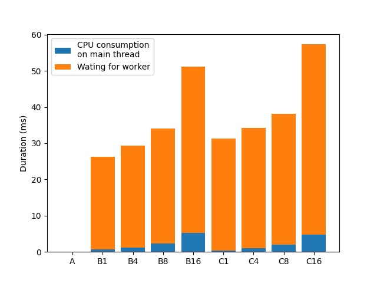

# Benchmark

## Implemantations
### Main thread


Simply using a single thread in JS.

### Indirect


Using worker_threads to parallelize.

### Direct


The way I propose. Communicates directly between native binary and worker_threads.

## Terms

- worker count: the number of worker threads used
- consume duration: the cpu time consumed by the hook
- labels in graphs
  - A: main thread
  - B*: indirect (worker count: *)
  - C*: direct (worker count: *)

## Results

### Initialization duration


Initializing the workers takes up to 60ms. If we can get more reduction than 60ms, then it's worth to run some plugins in worker threads. However, 60 ms is a negligible amount of time for a project of a certain size.

### Time taken to call the plugin's hook from rust
#### Overhead of calling a hook from multiple workers


This graph shows the time taken to call the plugin hook from rust multiple times in parallel. The number of times a hook is called is set so that the CPU time consumed for plugin hooks is same. For example, in the case where "consume duration" is 1, the hook is called 1000 times, and in the case where "consume duration" is 5, the hook is called 200 times.

In the indirect implementation, there's a overhead of calling a hook. This can be seen in the graph, as the smaller the "consume duration", i.e., the more times the hook is called, the longer the duration. Also the overhead gets bigger as the number of workers increases.
In contrast, in the direct implementation, the overhead doesn't exist. Not surprisingly, overhead does not increase as the number of workers increases.

In conclusion, in the indirect implementation, if the CPU time consumed by the hook is not long enough, the duration may increase even if a worker is used. However, in the direct implementation, the duration can be reduced by using a worker regardless of the time consumed by the hook.

Precisely, even in the direct implementation, the overhead does exist. When "consume duration" is 0 and the number of workers are smaller than or equal to 4, it takes more time than simply running in the main thread. See the "run (consumeDuration: 0, count: 1000, idLength: 30)" result in the raw results below.

#### Overhead of calling a hook with large data


Similar to the previous graph, this graph shows the time taken to call the plugin hook from rust multiple times in parallel. But the parameters are different. In all cases, consume duration is set to 10ms. "id length" is the length of the data passed to the hook and the data passed from the hook.

In both implementations, the larger the data, the larger the overhead. However, the increase in overhead is smaller in the direct implementation.

In conclusion, the direct implementation reduces the overhead of calling a hook with large data.

## raw results

<details>

```
initialize:
  main thread: 0.012ms
  indirect (worker count: 1): 25.351ms
  indirect (worker count: 4): 28.181ms
  indirect (worker count: 8): 32.109ms
  indirect (worker count: 16): 47.013ms
  direct (worker count: 1): 30.457ms
  direct (worker count: 4): 32.395ms
  direct (worker count: 8): 37.080ms
  direct (worker count: 16): 53.334ms
run (consumeDuration: 0, count: 1000, idLength: 30):
  main: 7.471ms
  indirect (worker count: 1): 103.358ms
  indirect (worker count: 4): 1457.120ms
  indirect (worker count: 8): 3259.583ms
  indirect (worker count: 16): 7218.530ms
  direct (worker count: 1): 26.614ms
  direct (worker count: 4): 7.710ms
  direct (worker count: 8): 4.838ms
  direct (worker count: 16): 3.093ms
run (consumeDuration: 1, count: 1000, idLength: 30):
  main: 999.928ms
  indirect (worker count: 1): 1004.372ms
  indirect (worker count: 4): 704.273ms
  indirect (worker count: 8): 1737.580ms
  indirect (worker count: 16): 4358.620ms
  direct (worker count: 1): 1000.195ms
  direct (worker count: 4): 249.977ms
  direct (worker count: 8): 125.079ms
  direct (worker count: 16): 62.978ms
run (consumeDuration: 3, count: 333, idLength: 30):
  main: 999.009ms
  indirect (worker count: 1): 999.165ms
  indirect (worker count: 4): 252.673ms
  indirect (worker count: 8): 187.974ms
  indirect (worker count: 16): 375.481ms
  direct (worker count: 1): 998.969ms
  direct (worker count: 4): 251.976ms
  direct (worker count: 8): 125.977ms
  direct (worker count: 16): 62.977ms
run (consumeDuration: 5, count: 200, idLength: 30):
  main: 1000.068ms
  indirect (worker count: 1): 999.963ms
  indirect (worker count: 4): 251.265ms
  indirect (worker count: 8): 131.172ms
  indirect (worker count: 16): 137.273ms
  direct (worker count: 1): 1000.039ms
  direct (worker count: 4): 249.979ms
  direct (worker count: 8): 124.980ms
  direct (worker count: 16): 64.982ms
run (consumeDuration: 10, count: 100, idLength: 30):
  main: 999.922ms
  indirect (worker count: 1): 1000.069ms
  indirect (worker count: 4): 249.981ms
  indirect (worker count: 8): 130.881ms
  indirect (worker count: 16): 71.374ms
  direct (worker count: 1): 999.979ms
  direct (worker count: 4): 249.980ms
  direct (worker count: 8): 129.981ms
  direct (worker count: 16): 69.975ms
run (consumeDuration: 10, count: 100, idLength: 10000):
  main: 999.954ms
  indirect (worker count: 1): 999.939ms
  indirect (worker count: 4): 249.981ms
  indirect (worker count: 8): 130.968ms
  indirect (worker count: 16): 72.181ms
  direct (worker count: 1): 999.973ms
  direct (worker count: 4): 249.979ms
  direct (worker count: 8): 129.967ms
  direct (worker count: 16): 69.976ms
run (consumeDuration: 10, count: 100, idLength: 100000):
  main: 1000.617ms
  indirect (worker count: 1): 1002.145ms
  indirect (worker count: 4): 253.245ms
  indirect (worker count: 8): 134.376ms
  indirect (worker count: 16): 86.170ms
  direct (worker count: 1): 999.959ms
  direct (worker count: 4): 250.166ms
  direct (worker count: 8): 130.082ms
  direct (worker count: 16): 70.083ms
run (consumeDuration: 10, count: 100, idLength: 1000000):
  main: 1071.537ms
  indirect (worker count: 1): 1148.172ms
  indirect (worker count: 4): 336.675ms
  indirect (worker count: 8): 212.726ms
  indirect (worker count: 16): 208.795ms
  direct (worker count: 1): 1100.431ms
  direct (worker count: 4): 280.206ms
  direct (worker count: 8): 157.280ms
  direct (worker count: 16): 88.989ms
```

</details>
